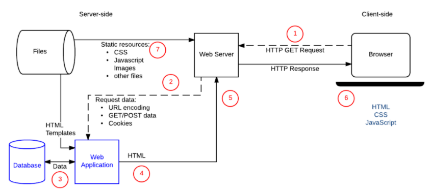
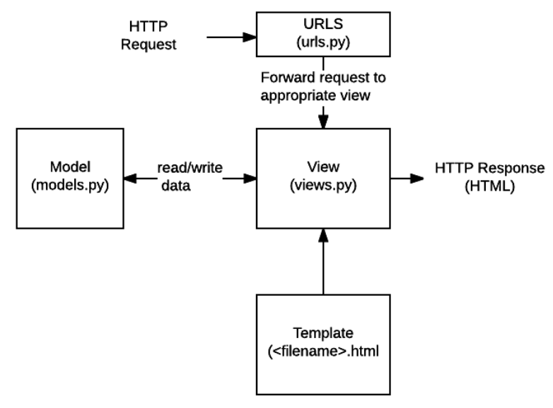

## 1주차 스터디

**Server-side Website Programming**

- 동적 웹사이트

  -필요 시 동적으로 응답 콘텐츠 생성

  -동적 웹사이트의 웹 페이지는 보통 HTML 템플릿에 있는 자리 표시자에 데이터베이스에서 가져온 데이터를 넣어 생성

  -사용자 또는 저장된 환경을 기반으로 URL에 대해 다른 데이터를 반환 할 수 있고, 응답을 반환하는 과정에서 다른 작업 수행 가능

  

  

  

- 서버 측 프로그래밍

  -동적 웹 사이트를 지원하는 코드 작성하는 것

  -제출 된 데이터 및 요청의 유효성 검사, 데이터 저장 및 검색을 위한 DB 사용, 올바른 데이터 전송과 같은 작업 처리

  -일반적으로 웹 프레임 워크 사용해 서버 코드 작성

- 웹 프레임워크 사용 이유

  -직접 구현해야 하는 많은 ‘공통’ 웹 서버 기능 제공(EX: 세션 지원, 사용자 인증 지원, DB와의 쉬운 연결, 템플릿 라이브러리 등)

**Django**

- 코드의 구성

  

->URLS: URL mapper로 요청된 URL 기준으로 HTTP 요청을 알맞은 View로 전달

->View: HTTP 요청 수신 뒤 HTTP 응답 반환하는 요청 처리 함수/ Model을 통해 필요한 데이터 접근, Template에게 응답 서식 설정 맡김 (ex: HTML 템플릿을 이용해 동적으로 HTML 페이지 만들고 Model에서 가져온 데이터로 채움)

->Models: 데이터 구조 정의, DB의 기록 관리(추가, 수정, 삭제), 쿼리 방법 제공하는 파이썬 객체

->Template: 파일의 구조나 레이아웃 정의

- 추가 기능

-양식(작성, 유효성 검사 처리 단순화), 사용자 인증 및 권한, 캐싱, 관리 사이트(앱 생성 시 기본적으로 포함됨), 데이터 직렬화(XML, JSON으로 직렬화하여 제공 가능)

### 장고 앱 작성하기 PART 1~PART 4

최종 내용: 설문조사 어플리케이션 만들기 / 설문 내용을 보고 직접 투표할 수 있는 개방 사이트 + 관리자가 설문을 추가, 변경, 삭제할 수 있는 관리용 사이트

- PART 1

*Django 프로젝트와 앱(App)

프로젝트: 특정 웹 사이트에 대한 구성 및 앱 모음, **여러 앱을 포함할 수 있음**

앱: 웹 로그 시스템, 소규모 설문 조사 앱과 같은 작업 수행하는 웹 어플리케이션, **하나의 앱이 여러 프로젝트에 존재 가능**

*View 작성

뷰를 호출하려면, 이와 연결된 url이 있어야 하는데, 이를 위해 URLconf를 사용

생성한 앱의(여기서는 polls) urls 모듈(polls/urls.py)을 최상위 URLconf(mysite/urls.py)에서 바라보게 설정해줘야 함

ex) path('polls/', include('polls.urls'))

--> include() 함수: 다른 URLconf들을 참조할 수 있도록 도와준다. URL의 해당 시점까지 일치하는 부분을 잘라내고, 남은 문자열 부분 후속 처리를 위해 include 된 URLconf로 전달 (다른 URL 패턴을 포함할 때마다 항상 include()를 사용해야 한다. admin.site.urls은 예외)

-->path() 함수: 2개의 필수 인수(route, view) + 2개의 선택 가능한 인수(kwargs or name)

- PART 2

*mysite/settings.py 안의 INSTALLED_APPS

 -이 파일은 현재 장고 인스턴스에서 활성화된 모든 Django 어플리케이션들의 이름이 담겨있다. 앱들은 다수의 프로젝트에서 사용될 수 있고, 다른 프로젝트에서 쉽게 사용될 수 있도록 패키징하여 배포 가능

*Model코드를 통해 

-해당 앱에 대한 데이터베이스 스키마 생성(CREATE TABLE)

-생성한 객체에 접근하기 위한 python 데이터베이스 접근 API 생성

*migrate 명령 

-아직 적용되지 않은 마이그레이션을 모두 수집해 실행하며 이 과정을 통해 모델에서의 변경 사항들과 데이터베이스의 스키마의 동기화가 이루어짐

- PART 3

*View의 2가지 역할

-요청된 페이지의 내용이 담긴 HttpResponse 객체 반환

-Http404 같은 예외 발생시키기

*URL의 이름공간(Namespace) 정하기

상황: 장고 프로젝트는 앱이 여러 개 포함될 수 있다. 이때 Django는 해당 앱들의 url을 어떻게 구별해 낼까?  템플릿 태그를 사용할 때, 어떤 앱의 뷰에서 url을 생성할 지 어떻게 알 수 있나?

해결: URLconf에 이름공간(namespace)를 추가하기 / ex: polls/urls.py 파일에 app_name을 추가하여 앱의 이름 공간을 설정할 수 있다.

- PART 4

*Generic View

기존 뷰: URL에서 전달 된 매개 변수에 따라 데이터베이스에서 데이터를 가져오는 것과 템플릿을 로드하고 렌더링된 템플릿을 리턴하는 기본 웹 개발의 일반적인 경우

제너릭 뷰: Django가 제공하는 위의 일반적인 경우를 위한 "제너릭 뷰" 시스템, 일반적인 패턴을 추상화하여 앱을 작성하기 위해 python 코드를 작성하지 않아도 된다.